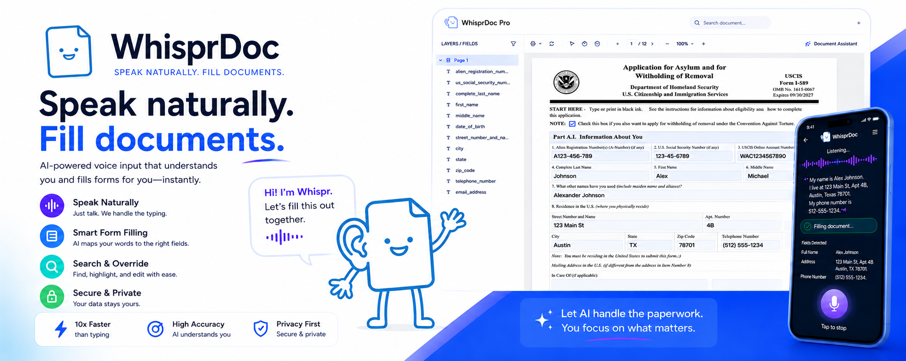
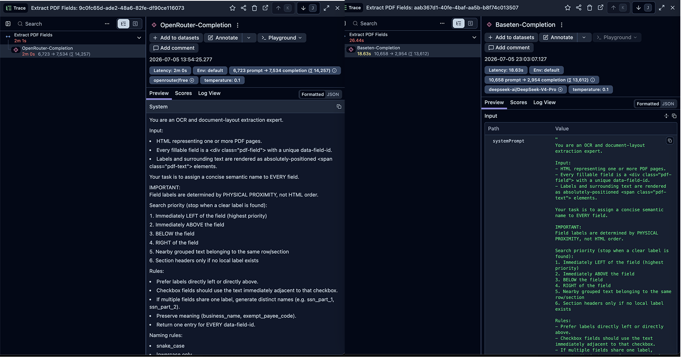
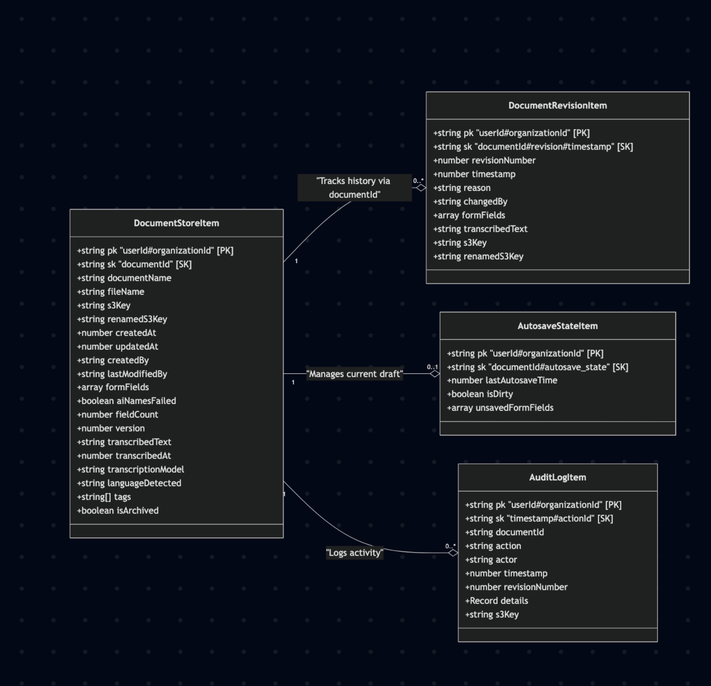

<div align="center">
  
  
  # WhisprDoc
  
  **Multilingual Voice-to-Text AI for Smart PDF Filling — Just talk. WhisprDoc does the rest.**

  [](#)
  [](#)
  [](#)
  [](#)
  [](#)
</div>

---

Over 25 million people in the U.S. alone have limited English proficiency, yet almost all critical infrastructure—tax forms, medical intakes, and legal documents—relies on dense, tedious English paperwork. **WhisprDoc** bridges this accessibility gap. Speak in 28+ languages, and our pipeline extracts the semantic context of your voice, mapping it perfectly to complex document schemas for completely automated, localized form-filling. 


## 📖 Table of Contents
- [Architecture & AI Pipelines](#-architecture--ai-pipelines)
- [Performance & Observability](#-performance--observability)
- [Evaluation Framework (CI/CD)](#-evaluation-framework-cicd)
- [Data Modeling & Persistence](#-data-modeling--persistence)
- [Installation & Getting Started](#-installation--getting-started)
- [Roadmap & Edge Cases](#-roadmap--edge-cases)

---

## 🏗 Architecture & AI Pipelines

WhisprDoc is built on a robust, highly observable architecture designed for **low-latency edge computing** and **high-scale production LLM inference**. 

We decouple heavy audio processing from the server by deploying a **quantized `Whisper-large-v3-turbo-ONNX` model directly on the edge (via WebWorkers)**. This dramatically reduces server costs, ensures zero audio payload latency, and guarantees maximum user privacy.

```text
[ Client / Frontend UI (React / Next.js App Router) ]
│
├── (Authentication UI)
│   └──► [ Supabase OAuth ] (User Sign-In & Session Management)
│
├── (Document Management)
│   └──► [ Document Viewer & PDF rendering ]
│
└── [ Pipeline 2: Voice-to-Text ]
    ├── 1. Audio Recording & Playback (Client-side)
    └── 2. [ Run WhisperAI ] (On-Device WebWorker & Quantized large-v3 ONNX)
           └──► (Generates raw transcript locally for privacy & zero-latency)
│
▼ (HTTPS / API Requests, Server Actions & File Uploads)
[ Next.js Server / Node.js Backend ]
│
├── (Authentication Validation)──► [ Supabase Auth Middleware ]
├── (Saves/Retrieves PDF files)──► [ Amazon S3 / Supabase Storage ]
├── (AI Observability & Tracing)─► [ Langfuse ] (Logs token usage, prompts, latency)
│
├── [ Pipeline 1: Automated Document Layout Extraction ]
│   ├── Step 1: Extract PDF Widgets & Text (pdf.js / pdf-lib)
│   ├── Step 2: Convert PDF Pages into structured HTML
│   ├── Step 3: Send HTML via API to Baseten Inference Infrastructure
│   ├── Step 4: Receive structured JSON with semantic field mappings
│   └── Step 5: Map JSON fields back to original document (Creates "Mapped PDF")
│
├── [ Pipeline 2: Conversational Form Filling ]
│   ├── Step 1: Receive locally generated Whisper Transcript from Client
│   ├── Step 2: Send Transcript + Document Context via API to Baseten
│   ├── Step 3: Receive structured JSON with extracted values
│   └── Step 4: Map JSON data into correct input widgets (Creates "Filled PDF")
│
▼ (External API Calls via Vercel AI SDK / Custom fetch providers)
[ Baseten AI Infrastructure (e.g., DeepSeek / Qwen Models) ]
│
▼ (Data Persistence & Read / Write Operations via AWS SDK)
[ AWS DynamoDB Tables ]
```

---

## ⚡ Performance & Observability

To deliver a production-grade experience, latency and observability are treated as first-class citizens. By migrating our core model inference to **Baseten** and deeply integrating **Langfuse** for granular tracing of LLM spans, token usage, and prompt execution, I achieved massive latency reductions.

**Impact:** Pipeline 1 (Automated Document Layout Extraction) saw a **357.81% reduction in wait time**, dropping from an unacceptable `2m 1s` down to `26.43s`.

<div align="center">
  
</div>

---

## 🧪 Evaluation Framework (CI/CD)

Deploying AI to production requires rigorous evaluation to ensure prompt tweaks or model weight updates don't silently degrade accuracy. I utilize **Promptfoo** to evaluate both Pipeline 1 (OCR/HTML) and Pipeline 2 (Transcript Data Extraction) against complex real-world forms (W-9, W-4, 1040) and multilingual inputs.

Our LLM-as-a-judge rubrics enforce strict matching for identifiers (SSN, EIN, Booleans) while allowing semantic leniency for localized addresses and transliterated names.

<details>
<summary><b>View Promptfoo Evaluation Evals (YAML Configuration)</b></summary>

```yaml
description: "OCR Evaluation on Forms and Transcripts"

prompts:
  - id: file://evals/html-prompt.txt
    label: html-stage
  - id: file://evals/transcript-prompt.txt 
    label: transcript-stage

providers:
  - file://evals/basetenProvider.ts

defaultTest:
  options:
    provider:
      id: openai:chat:openai/gpt-4o-mini # Evaluator Model
      
tests:
  # ── Stage 1: HTML → Field Name Extraction ─────────────────────────────────
  - vars:
      html_input: file://evals/html/w4.html
      expected_output: file://evals/expected/field/w4.json
    prompts:
      - html-stage
    assert:
      - type: llm-rubric
        value: |
          You are an expert evaluation judge analyzing OCR field-name extraction accuracy.
          Your task is to rate the actual JSON output against the expected ground truth JSON.
          CRITERIA FOR KEY MATCHING (Loosely Enforced):
          - Do NOT require a perfect string match for JSON keys. 2-3 matching words are completely sufficient.
          - Focus heavily on whether the factual data values line up with corresponding semantic fields.
          Expected Ground Truth JSON:
          {{expected_output}}

  # ── Stage 2: Transcript → Structured JSON Extraction (Multilingual) ───────
  - vars:
      transcript: file://evals/expected/transcript/spanish.txt
      schema: file://evals/schema/w4.json
      expected_output: file://evals/expected/transcript/w4.json
    prompts:
     - transcript-stage
    assert:
      - type: contains-json
        value: file://evals/schema/w4.json
      - type: llm-rubric
        value: |
          You are an expert evaluation judge for multilingual transcript data extraction.
          STRICT RULES (these must match exactly):
          - Boolean fields (true/false) must be exactly correct.
          - SSN format must be XXX-XX-XXXX.
          - Date format must be YYYY-MM-DD.
          LENIENT RULES (be forgiving here):
          - Address/location: accept if same location (e.g. "Spain" vs "España").
          Expected Ground Truth JSON:
          {{expected_output}}
```
</details>

---

## 🗄 Data Modeling & Persistence

WhisprDoc utilizes a **document-centric NoSQL database (Amazon DynamoDB)** optimized for versioning, autosave state management, and strict auditability.

<div align="center">
  
</div>

* **`DocumentStoreItem` (Primary Table):** Stores the current "live" version. The partition key (`userId#organizationId`) provides strict tenant isolation.
* **`DocumentRevisionItem` (Revision History):** Implements immutable versioning. Keyed by `documentId#revision#timestamp`, it stores historical snapshots of form fields, enabling rollback and full historical traceability.
* **`AutosaveStateItem` (Draft State):** Maintains transient client editing state independently of the committed document. Enables crash recovery without polluting authoritative records.
* **`AuditLogItem` (Activity Log):** Immutable system events for enterprise compliance (who changed what, and when).

---

## 🚀 Installation & Getting Started

### Prerequisites
* **Node.js** (v18.x or higher)
* **Python** 3.10+ (for evaluating/testing data pipelines locally)
* **Docker** (optional, for local DB/S3 replication)
* API Keys for **Baseten** (Inference), **Langfuse** (Observability), and **Supabase** (Auth/Storage).

### Setup

1. **Clone the repository:**
   ```bash
   git clone https://github.com/ralaurent/whispr-doc-pro-baseten
   cd whispr-doc-pro-baseten
   ```

2. **Install dependencies:**
   ```bash
   npm install
   ```

3. **Configure Environment Variables:**
   ```bash
   cp .env.example .env.local
   ```

4. **Run the development server:**
   ```bash
   npm run dev
   ```
   *The app will be available at `http://localhost:3000`.*

---

## 🛤 Roadmap & Edge Cases

Building reliable AI systems requires navigating ambiguity and continuous optimization. I'm actively working on the following architectural enhancements:

* **Non-Acroform / Scanned Document Support:** 🚧 *Currently fine-tuning* 🚧 I'm training a custom object-detection model on the CommonForms dataset to generate numbered bounding-box overlays for flattened PDFs, bypassing the need for native Acroform widgets.
* **Token Economics & Context Optimization:** Sending full-page HTML/text is expensive. I'm developing an algorithmic pre-processor that strips out static text not in the immediate vicinity of input boxes, completely ignoring pages with zero text inputs.
* **Concurrent Inference for Large Documents:** Evals show latency spikes for documents exceeding 50 fields. I'm implementing a chunking mechanism to split field extraction and run inference concurrently, heavily optimizing end-user wait times.
* **System Prompt Hardening:** Expanding our Promptfoo test suite with high-noise, real-world data distributions (background chatter in audio, highly ambiguous user commands) to improve deterministic outputs. 
